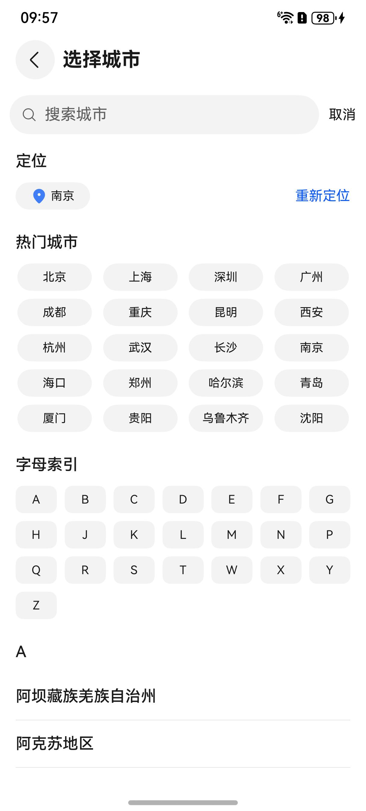

# 城市选择组件快速入门

## 目录

- [简介](#简介)
- [约束与限制](#约束与限制)
- [快速入门](#快速入门)
- [API参考](#API参考)
- [示例代码](#示例代码)

## 简介

本组件提供城市选择与定位的功能。



## 约束与限制

### 环境

* DevEco Studio版本：DevEco Studio 5.0.4 Release及以上
* HarmonyOS SDK版本：HarmonyOS 5.0.4 Release SDK及以上
* 设备类型：华为手机（直板机）
* HarmonyOS版本：HarmonyOS 5.0.4 Release及以上

### 权限

* 获取位置权限：ohos.permission.APPROXIMATELY_LOCATION

## 快速入门

1. 安装组件。
   如果是在DevEvo Studio使用插件集成组件，则无需安装组件，请忽略此步骤。

   如果是从生态市场下载组件，请参考以下步骤安装组件。
   a. 解压下载的组件包，将包中所有文件夹拷贝至您工程根目录的XXX目录下。

   b. 在项目根目录build-profile.json5添加module_city_select模块。

    ```typescript
    // 在项目根目录build-profile.json5填写module_city_select路径。其中XXX为组件存放的目录名
    "modules": [
        {
        "name": "module_city_select",
        "srcPath": "./XXX/module_city_select",
        }
    ]
    ```
   c. 在项目根目录oh-package.json5中添加依赖。
    ```typescript
    // XXX为组件存放的目录名称
    "dependencies": {
      "module_city_select": "file:./XXX/module_city_select"
    }
   ```

2. [开通地图服务](https://developer.huawei.com/consumer/cn/doc/harmonyos-guides/map-config-agc)用于实现城市的定位。

3. 引入组件。

    ```
    import { CitySearchController, UICitySelect } from 'module_city_select'
    ```


## API参考

### UICitySelect(option: UICitySelectOptions)

**UICitySelectOptions对象说明**

| 参数名                    | 类型                                            | 是否必填 | 说明          |
|:-----------------------|:----------------------------------------------|:-----|:------------|
| currentCity            | string                                        | 否    | 当前定位城市      |
| controller             | [CitySelectController](#CitySelectController) | 否    | 城市选择控制器     |
| goBack                 | (city?: string) => void                       | 否    | 返回上一级页面     |
| emitUpdateCityLocation | (city: string) => void                        | 否    | 更新当前定位城市的回调 |

### CitySelectController

分类组件的控制器，用于控制分类条目的滚动。同一个控制器不可以控制多个分类组件。

#### constructor

constructor()

CitySelectController的构造函数。

#### onBackPressed

onBackPressed(): boolean

触发组件内部返回事件

## 示例代码

```
import { CitySearchController, UICitySelect } from 'module_city_select';

@Entry
@ComponentV2
struct CitySelectSample {
  @Local currentCity: string = '武汉';
  controller: CitySearchController = new CitySearchController();

  onBackPress(): boolean | void {
    return this.controller.onBackPressed();
  }

  build() {
    NavDestination() {
      Column() {
        UICitySelect({
          currentCity: this.currentCity,
          controller: this.controller,
          emitUpdateCityLocation: (city: string) => {
            this.currentCity = city;
          },
          goBack: (citySelected?: string) => {
            if (citySelected){
              this.currentCity = citySelected
              const message = citySelected ? `选择了${citySelected}并返回` : '直接返回';
              this.getUIContext().getPromptAction().showToast({ message });
            }
          },
        })
      }
      .width('100%')
    }
    .height('100%')
    .width('100%')
    .title('城市选择组件')
  }
}
```
