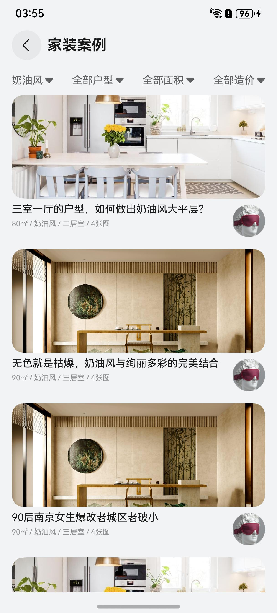

# 列表筛选组件快速入门

## 目录

- [简介](#简介)
- [约束与限制](#约束与限制)
- [快速入门](#快速入门)
- [API参考](#API参考)
- [示例代码](#示例代码)

## 简介

本组件提供列表筛选组件，支持条件筛选和列表展示等功能。



## 约束与限制

### 环境

* DevEco Studio版本：DevEco Studio 5.0.4 Release及以上
* HarmonyOS SDK版本：HarmonyOS 5.0.4 Release SDK及以上
* 设备类型：华为手机（直板机）
* HarmonyOS版本：HarmonyOS 5.0.4 Release及以上

## 快速入门

1. 安装组件。

   如果是在DevEvo Studio使用插件集成组件，则无需安装组件，请忽略此步骤。

   如果是从生态市场下载组件，请参考以下步骤安装组件。
   a. 解压下载的组件包，将包中所有文件夹拷贝至您工程根目录的XXX目录下。

   b. 在项目根目录build-profile.json5添加module_filter_list模块。

    ```typescript
    // 在项目根目录build-profile.json5填写module_filter_list路径。其中XXX为组件存放的目录名
    "modules": [
        {
        "name": "module_filter_list",
        "srcPath": "./XXX/module_filter_list",
        }
    ]
    ```
   c. 在项目根目录oh-package.json5中添加依赖。
    ```typescript
    // XXX为组件存放的目录名称
    "dependencies": {
      "module_filter_list": "file:./XXX/module_filter_list"
    }
   ```

2. 引入组件。

    ```
    import { FilterList, FilterOption, LayoutType } from 'module_filter_list';
    ```

## API参考

### FilterList(option: FilterListOptions)

#### FilterListOptions对象说明

| 参数名              | 类型                                              | 是否必填 | 说明          |
|:-----------------|:------------------------------------------------|:-----|:------------|
| listBuilderParam | CustomBuilder                                   | 否    | 展示列表区域自定义内容 |
| layoutStyle      | [LayoutType](#LayoutType枚举说明)                   | 否    | 筛选行布局风格     |
| filterOptions    | FilterOption[](#FilterOption对象说明)               | 否    | 筛选条件配置      |
| onchange         | (data: [ResultItem](#ResultItem对象说明)[]) => void | 否    | 筛选条件改变的回调事件 |

#### LayoutType枚举说明

| 名称      | 值 | 说明                        |
|:--------|:--|:--------------------------|
| DEFAULT | 0 | 默认布局，无分割线，筛选条件文本弹性均匀分布    |
| SPLIT   | 1 | 分割线布局，有分割线，筛选条件从左到右固定间隔分布 |

#### FilterOption对象说明

| 参数名         | 类型       | 是否必填 | 说明              |
|:------------|:---------|:-----|:----------------|
| name        | string   | 是    | 筛选类型名称          |
| selectIndex | number   | 是    | 备选项数组中，选中项的对应索引 |
| selectArr   | string[] | 是    | 备选项数组           |

#### ResultItem对象说明

| 参数名         | 类型     | 说明        |
|:------------|:-------|:----------|
| filterName  | string | 筛选类型名称    |
| selectIndex | number | 该类型选中项的索引 |

## 示例代码

```
import { FilterList, FilterOption, LayoutType } from 'module_filter_list';

@Entry
@ComponentV2
struct Index {
  types: string[] = ['一居室', '两居室', '三居室', '四居室'];
  styles: string[] = ['原木风', '简约风', '新中式', '奶油风'];
  @Local typeIndex: number = 0;
  @Local styleIndex: number = 0;
  @Local listArr: string[] = new Array(5).fill('');
  @Local filterOptions: FilterOption[] = [
    new FilterOption('房屋户型', this.typeIndex, this.types),
    new FilterOption('房屋风格', this.styleIndex, this.styles),
  ];

  build() {
    Column() {
      FilterList(
        {
          filterOptions: this.filterOptions,
          layoutStyle: LayoutType.SPLIT,
          onchange: (res) => {
            this.typeIndex = res[0].selectIndex;
            this.styleIndex = res[1].selectIndex;
          },
        },
      ) {
        List({ space: 12 }) {
          ForEach(this.listArr, (item: string, index) => {
            ListItem() {
              Column({ space: 12 }) {
                Image($r('app.media.sample')).width('100%').height(140).borderRadius(16);
                Text(this.types[this.typeIndex] + '  ' + this.styles[this.styleIndex]);
              };
            };
          });

        }.padding({ top: 12, right: 16, left: 16 }).layoutWeight(1)
      };
    };
  }
}
```
