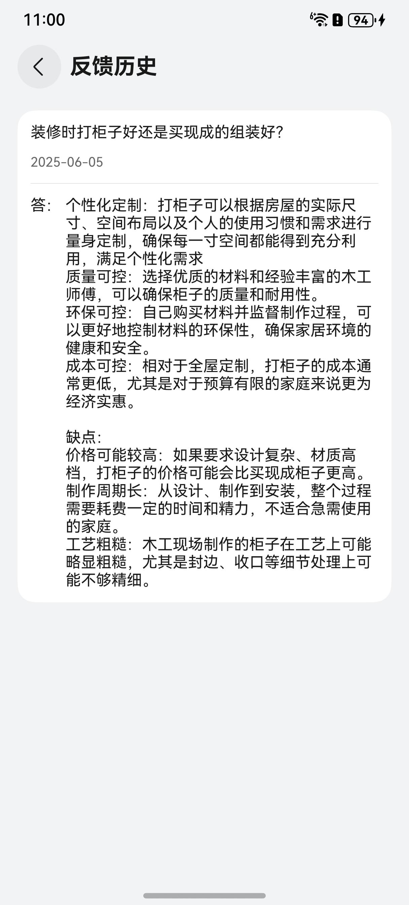

# 意见反馈组件快速入门

## 目录

- [简介](#简介)
- [约束与限制](#约束与限制)
- [快速入门](#快速入门)
- [API参考](#API参考)
- [示例代码](#示例代码)

## 简介

本组件提供填写意见、发布意见的功能。

| 意见反馈                                             | 反馈历史                                            | 反馈历史详情                                         |
|--------------------------------------------------|-------------------------------------------------|------------------------------------------------|
|  |  |  |

## 约束与限制

### 环境

* DevEco Studio版本：DevEco Studio 5.0.4 Release及以上
* HarmonyOS SDK版本：HarmonyOS 5.0.4 Release SDK及以上
* 设备类型：华为手机（直板机）
* HarmonyOS版本：HarmonyOS 5.0.4 Release及以上

## 快速入门

1. 安装组件。

   如果是在DevEvo Studio使用插件集成组件，则无需安装组件，请忽略此步骤。

   如果是从生态市场下载组件，请参考以下步骤安装组件。
   a. 解压下载的组件包，将包中所有文件夹拷贝至您工程根目录的XXX目录下。

   b. 在项目根目录build-profile.json5添加module_posting模块。

    ```typescript
    // 在项目根目录build-profile.json5填写module_posting路径。其中XXX为组件存放的目录名
    "modules": [
        {
        "name": "module_posting",
        "srcPath": "./XXX/module_posting",
        }
    ]
    ```
   c. 在项目根目录oh-package.json5中添加依赖。
    ```typescript
    // XXX为组件存放的目录名称
    "dependencies": {
      "module_posting": "file:./XXX/module_posting"
    }

2. 本组件基于全屏模式适配，使用组件需要在入口文件进行如下配置。
    ```
    // entry/src/main/ets/entryability/EntryAbility.ets
    ...
    onWindowStageCreate(windowStage: window.WindowStage): void {
     windowStage.getMainWindow((err, data) => {
          data.setWindowLayoutFullScreen(true)
        });
    }
    ...
    ```
3. 引入组件。

    ```
   import { UrlMap,WindowUtil } from 'module_posting'
    ```

## API参考

不涉及。

## 示例代码

```
import { UrlMap,WindowUtil } from 'module_posting'

@Entry
@ComponentV2
struct Index {
  stack: NavPathStack = new NavPathStack()

  aboutToAppear(): void {
    WindowUtil.initWindowUtil()
  }

  build() {
    Navigation(this.stack) {
     Column(){
       Blank().height(WindowUtil.avoidAreaSize.top)
       Column({ space: 10 }) {
         Text('意见反馈').fontSize(20).fontWeight(FontWeight.Bold)
         Button('go').width('100%').onClick(() => {
           this.stack.pushPath({
             name: UrlMap.FEEDBACK_PAGE
           })
         })
       }
       .justifyContent(FlexAlign.Center)
       .layoutWeight(1)
       Blank().height(WindowUtil.avoidAreaSize.bottom)
     }

    }
    .hideTitleBar(true)
    .mode(NavigationMode.Stack)
  }
}
```
